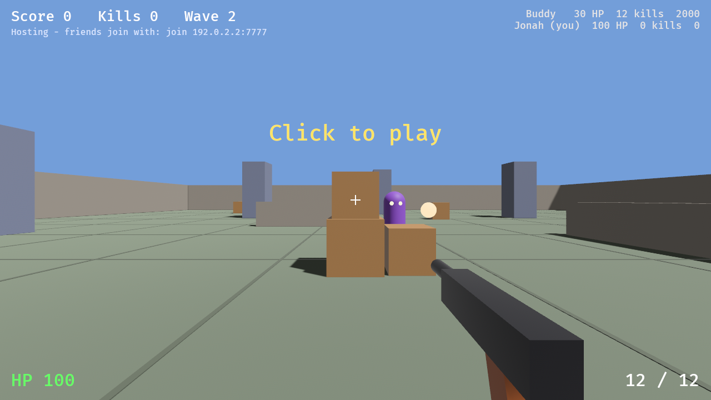

# Rust FPS

Current version: **v6.1** (shown on the main menu and in the window title). Each version is one commit in this repo, its message starting with the version (v1 ... v6); small updates bump the minor number (v6.1, v6.2...).

A co-op zombie-style wave-survival shooter written in Rust with [Bevy](https://bevyengine.org) 0.16. Play solo or with up to 8 friends.



## Build

1. Install Rust: https://rustup.rs
2. In this folder run `cargo build --release`. The first build compiles Bevy and takes a few minutes; later builds are fast.

**Windows:** the Rust installer asks for the Visual Studio C++ build tools; install them. (Or skip building and use the ready-made `RustFPS-windows.zip`.)

**Linux:** install the system libraries Bevy needs first, e.g. on Ubuntu/Debian:

```sh
sudo apt install g++ pkg-config libx11-dev libasound2-dev libudev-dev libxkbcommon-x11-0 libwayland-dev libxkbcommon-dev
```

## Play

Run the game (`cargo run --release`, or double-click `rust-fps.exe`) and use the menus:

- **Play Solo**, **Host a Party** or **Join a Party** (type or paste the host's address with Ctrl+V).
- **Loadout**: pick the gun you bring into matches and its attachments (see Career below).
- **Characters**: pick one of 6 characters (Striker, Warden, Ronin, Tinker, Blaze, Valkyrie).
- **Gun Skins**: open crates with your spins and equip skins.
- **Attachment Guide**: every attachment and exactly what it changes, with a tab per slot.
- **Sandbox**: a practice match with no waves and a tools panel (F1) to spawn zombies, switch on god mode and free abilities, add points, jump rounds and try any gun with any attachments.
- **Settings**: field of view, mouse sensitivity, volume (master plus guns, enemies, movement, effects and interface), graphics (shadows, smoothed edges, glow, soft corner shading), windowed / borderless / fullscreen, resolution and key remapping.

Before a match you're on the party screen: pick your character, the host picks the map and day or night, friends press Ready and the host presses Start. Friends can also join a match that's already running.

**Playing over the internet:** on the same Wi-Fi it just works. Otherwise the host forwards UDP port 7777 on their router and shares their internet address (the party screen shows it when you click "Click to reveal", so it never appears on stream by accident), or everyone uses a virtual LAN like Tailscale or ZeroTier. Everyone must run the same version. On Windows, allow the game through the firewall when asked.

Command-line shortcuts still work: `rust-fps solo`, `rust-fps host [port]`, `rust-fps join <address>`, plus `--name <name>`, `--map <0-2>` and `--start` (skip the party screen).

## Controls (default, all remappable)

| Input | Action |
|---|---|
| Mouse | Look / shoot (hold for automatic guns) |
| V | Melee: a quick knife slash (cancels a reload) |
| W A S D | Move |
| Shift | Sprint (you can shoot while sprinting) |
| Space | Jump. Bunny hop by tapping it again just as you land: each well-timed tap adds speed (holding it does nothing) |
| C | Crouch. Press while running to slide; hold it as you land from a jump to chain jump-slides |
| R | Reload |
| Right mouse | Aim down sights (zooms in, steadier shots) |
| F | Buy / use (mystery box, perk machines, doors, wall guns) |
| Q / E | Abilities 1 and 2 (see casting below) |
| X | Ultimate |
| T, 1 / 2, mouse wheel | Swap between your two guns |
| B | Pick a level-up upgrade |
| G, then 1-5 | Emotes: dance, wave, flip off, point, backflip |
| Z or middle mouse | Ping: mark a spot or an enemy for your team |
| Tab | Scoreboard |
| Esc | Menu (pauses solo games) |
| F1 | Sandbox tools (sandbox matches only) |

## Casting abilities

Each ability can use its own cast mode (Settings > Casting):

- **Instant:** casts the moment you press the key.
- **Quick** (default): hold the key to aim with a preview (grenade arc and landing ring, dash arrow, blast radius, orbital target), release to cast.
- **Confirm:** press the key to aim, left-click to cast, right-click or the key again to cancel.

The frag grenade is held in your hand while you aim, for as long as you like: it only arms when it leaves your hand. Every ability has its own first-person animation (Ronin draws a katana for Iaido Slash, Valkyrie raises her spear, Tinker sets the turret down...), and while an ability or ultimate is active a glow in its colour surrounds the caster and the edge of your screen.

## What you see

Every gun is modelled (23 in all) and held in gloved first-person hands, with animations for equipping, recoil, reloading (the magazine comes out and a fresh one goes in; revolvers, the double barrel and pump shotguns load shell by shell), pumping, sprinting and throwing. Teammates hold the gun they're using. Abilities have their own effects: dash trails, a grenade with a burning fuse and a fireball explosion with smoke and debris, a healing column, an ice nova with spikes, and an orbital strike with a targeting laser. The mystery box opens its lid and spins through the guns, and flies away when it moves; perk machines are vending machines; power-ups are little models. Every gun has its own recoil pattern and visible attachments, sights line up when you aim, tracers streak and fade, and hits show a hit marker (orange for headshots, red for kills). Zombies fall over with a death animation, and shooting their legs out turns them into crawlers. Everything has sound. The three maps are built from detailed props (containers, cranes, forklifts and a ship; trees, a fountain, a bandstand and a playground; houses, fences, cars and street lights).

## Gameplay

- **Rounds:** zombies come in rounds that get bigger and tougher. Grunts rush you, Shooters throw fireballs from a distance (round 3+), Brutes are big and tanky (round 6+). Downed players get back up at the start of the next round; if the whole team is down, it's game over.
- **Points:** 10 per hit, 60 per kill (Brutes 120), +40 for headshots. Spend them on the mystery box and perks.
- **Two guns:** you start with the M9 Sidearm and can carry two guns. Spare ammo is topped up at the start of each round.
- **Mystery box:** 750 points per spin, always. Its beam goes up into the sky so you can find it from anywhere. It gives one of 20 guns, or rarely one of 2 wonder weapons (Ray Blaster: explosive shots; Thunder Cannon: lightning that chains between enemies). Box guns come with random attachments: all, some or none of an optic (Red Dot, Holo Sight, 3x Scope), a muzzle, an underbarrel grip or laser and an extended mag. The box sits at one of 5 spots and every few spins it may fly away to another (you get your points back).
- **Perk machines:** Quick Hands (3000, reload twice as fast), Stamina Rush (2000, faster sprint and slides), Boom Shot (3500, headshots can explode), Juggernaut (2500, 200 max health), Rapid Fire (2000, shoot 33% faster). You lose your perks when you go down.
- **Power-ups** drop from zombies: Nuke (kills everything, +400 points each), Insta-Kill, Double Points (30 seconds each) and Max Ammo.
- **Bigger maps and doors:** every map has its starting area plus 4 more areas around it, each behind a blocked passage you buy open (750-1250 points): stacked crates under a container tunnel in the yard, boarded-up stone arches in the park and garden pergolas in the neighbourhood. Zombies only come from areas that are open. One of the perk machines is behind a door.
- **Buildings:** each map has two walk-through buildings joining neighbouring areas, with their own way in to clear (1250 points): the Cold Store and Machine Shop in the yard, the Library and Museum in the park, the Mall and Diner in the neighbourhood. Go in through one area and come out in another.
- **Melee:** press V for a quick knife slash at whatever is right in front of you, crawlers included.
- **Wall guns:** each map has 2 guns hanging on walls (chalk outline). Guns players bring from their loadout take these boards. Buy the gun (pistol 500, SMG or shotgun 1000, rifle 1250), or ammo for half price if you already have it. Wall guns never come out of the mystery box on that map.
- **Day and night:** the host picks Day or Night on the party screen. At night the sky is dark, the street lamps are brighter and everyone has a flashlight.
- **Emotes and pings:** press G for the emote list; the camera pulls out so you can see your character (move or shoot to stop). Press Z to ping a spot (yellow beam) or an enemy (red marker that follows it), with your name and the distance.
- **Characters:** Striker has Dash, Frag Grenade and the Overdrive ultimate (more damage, faster fire, no ammo use). Warden has Heal Pulse (heals you and nearby teammates), Frost Nova (damages and slows enemies around you) and the Orbital Strike ultimate. Ronin has Iaido Slash, Shadow Step and the Blade Storm ultimate (a whirl of crimson and gold kunai). Tinker has Sentry Turret, Supply Drop (ammo and healing for teammates nearby) and the Tesla Coil ultimate. Blaze has Firebomb, Flame Wave and the Inferno ultimate. Valkyrie has Arc Spear (a lightning spear thrown in a line), Storm Leap and the Ragnarok ultimate. Every character has their own model. Ultimates charge over time and with kills.
- **Levels:** kills give XP. Every level adds 3% damage, and every 5 levels you pick an upgrade (press B): a stronger ability tier, or an element. At levels 5, 10, 15, 20 and 25 one of the choices is always an element. Elements: Fire (burns over time), Ice (slows) and Shock (arcs to nearby enemies), for your guns or your abilities.
- **Extraction:** after clearing round 15, and every 10 rounds after that (25, 35...), a green extraction beam opens for 45 seconds. Get every living teammate into it for 5 seconds to extract, or ignore it and keep fighting.
- **Zombies:** walkers (in three outfits), spitters that spit fireballs from range and hulking brutes.
- **Maps:** Shipping Yard, Central Park and The Neighborhood.

## Career and loadout

Every match earns career XP (150 per round survived, 3 per kill, 600 for extracting). Each career level unlocks a gun or attachment for your loadout, 27 levels in all; the Viper .45, Hornet MP and Breacher 12 are unlocked from the start.

On the Loadout screen pick a gun to bring and its attachments. In every match it hangs on one of the map's wall boards with your attachments on it (with your name), and the mystery box leaves it out. With two or more players, the first two loadouts take the two boards.

## Gacha spins, crates and skins

Crates open with a carousel that slides through the skins and slows down onto your prize. Spins are earned by how far you get, so restarting round 1 over and over earns nothing:

| Rounds survived | Spins |
|---|---|
| under 5 | 0 |
| 5 | 1 |
| 10 | 3 |
| 15 | 6 |
| 20 | 10 |
| 25 | 15 |

Extracting gives the same spins as reaching that round; it doesn't double them.

There are 35 skins in 5 crates. 12 are finishes that fit every gun; the other 23 are patterned skins made for one gun each (camo, tiger stripes, carbon fibre, damascus, marble, dragon scales, glowing lava, circuits, starfields...). A gun skin only shows on its own gun, so you can give every gun its own look; click an equipped gun skin again to take it off.

| Crate | Cost | Inside |
|---|---|---|
| Field Crate | 1 spin | 4 finishes + 5 gun skins |
| Street Crate | 1 spin | 4 finishes + 5 gun skins |
| Forge Crate | 1 spin | 3 finishes + 5 gun skins |
| Inferno Crate | 1 premium spin | 4 gun skins, Epic or Legendary only |
| Cosmos Crate | 1 premium spin | 4 gun skins, Epic or Legendary only |

Each crate's odds are Common 55%, Rare 30%, Epic 12%, Legendary 3%, shared out over the rarities that crate holds (premium crates: Epic 80%, Legendary 20%). Every 3 duplicate regular pulls give a free spin; a premium duplicate gives back a quarter of a premium spin.

**Premium spins:** trade 5 regular spins for 1 premium spin, or earn a quarter of a premium spin for every 20 rounds you survive (added up over all your matches).

Your profile and settings are saved in `%APPDATA%\RustFPS` on Windows (`~/.config/rust-fps` on Linux).

## How the multiplayer works

The host runs the game: rounds, zombies, damage, points, the box and perks. Each player moves their own character on their own machine (so movement never feels laggy) and sends their position, shots and actions to the host about 60 times a second. Purchases and abilities are numbered and resent until the host confirms them, so a lost packet never loses a purchase. The host sends everyone a snapshot of the party, the match and every zombie 30 times a second over UDP.

## Code layout

| Path | What's in it |
|---|---|
| `src/main.rs` | App setup, shared state (players, match state) and system ordering |
| `src/data.rs` | Guns, attachments, skins, crates, characters, abilities, perks, power-ups, elements, XP |
| `src/config.rs` | Settings, key bindings and the saved profile |
| `src/progression.rs` | Career levels, unlocks and loadouts |
| `src/game.rs` | Match start and end, in-game menus, cursor, box visuals, spin rewards |
| `src/graphics.rs` | Applies the graphics settings and distance haze |
| `src/player.rs` | Camera and movement (sprint, slide, crouch, bunny hop) |
| `src/weapons.rs` | Two gun slots, firing, recoil, reloading, melee |
| `src/abilities.rs` | Ability and buy input, cast modes, aiming previews |
| `src/viewmodel.rs` | First-person gun and hands, with all their animations and ability props |
| `src/sim.rs` | Host-only simulation: rounds, zombie AI, damage, elements, XP, box, perks, power-ups, extraction, sandbox |
| `src/zombies.rs` | Zombie animation, crawlers and death falls |
| `src/physics.rs` | Box collisions and ray casts |
| `src/emotes.rs`, `src/pings.rs` | Emotes and the third-person emote camera; pings |
| `src/hud.rs` | In-game HUD, hit markers, scoreboard, level-up picker, end screen |
| `src/net.rs` | Command line, UDP messages, host and client networking, internet address lookup |
| `src/maps/` | The three maps (`mod.rs`), props, the areas behind the doors (`strips.rs`), the walk-through buildings (`interiors.rs`) and zombie pathfinding (`nav.rs`) |
| `src/models/` | The modelling kit, the 23 gun models, gun skins, hands, gun mounts and other players' models |
| `src/rig/` | Skeleton and animation (`mod.rs`), the 6 hero models and the zombie models |
| `src/fx/` | Tracers, explosions, ability effects, and the ability auras |
| `src/audio/` | Sound effects, made by a small synthesizer at startup, and volume groups |
| `src/ui/` | Menus (`mod.rs`), the crate carousel, loadout and attachment guide, sandbox tools |
